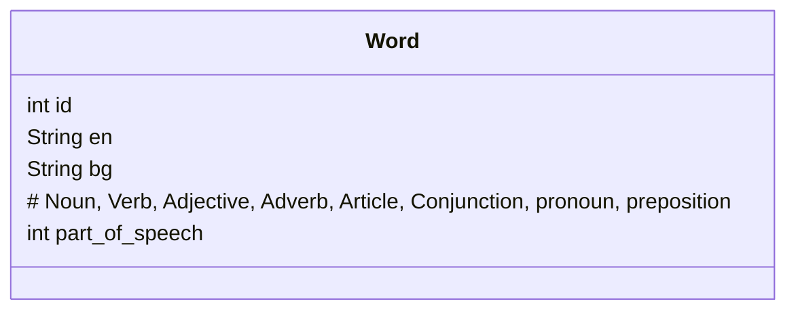

# Background

In high school I took three years of Spanish classes.  Unfortunately, I never really put the effort in to become properly fluent and am instead left mostly with a list of words I can identify.

A couple of years ago I read [Fluent in Three Months](https://www.amazon.ca/Fluent-Months-Anyone-Language-Anywhere/dp/0062282697/ref=sr_1_2?crid=3EIDH85VULGC&keywords=how+to+be+fluent+in&qid=1652553951&sprefix=how+to+be+fluent+in%2Caps%2C127&sr=8-2) and was inspired to tackle learning a new language.  After studying and working with computer languages, I realized that learning new ones became easier and easier as I began to understand the underlying concepts.  

Around the same time, I committed myself to learning Bulgarian to a conversational level.  The choice of language is primarily influenced by having direct access to multiple people that speak the language. I knew this would be critical for me to actually succeed in properly learning.

I needed somewhere to begin, but was disappointed to find that Duolingo doesn't support Bulgarian.  Thankfully I stumbled on [bulgaro.io](https://www.bulgaro.io/).  This course is a fantastic and simple introduction to all of the key concepts in the Bulgarian language.  I was happy to pay the small subscription fee, knowing that it would motivate me to actually complete the course.  I set up a routine of a couple lessons every day and before long I made it all the way through the course.

I learned a lot in this time, particularly around the rules and conventions of the language.  But I was still completely incapable of stringing together full sentences. Once I lost the structure of the course, I struggled to know where to invest my learning time into.  Slowly I spent less and less time on it and the knowledge I had gained started to fade.

In two weeks I go to Bulgaria, so I have picked things back up and am doing my best to get to a level where I can at least participate in some small way while there.  I've started to craft my own structure for learning and as usual it has led me to come up with a small command line program to assist.

# The `vocab` CLI App

I have acquired some basic vocabulary from my initial course and other learnings, but I have found it difficult to decide what vocabulary to focus on.  There is surely some limit to the number of words I can properly encode in a given day. How do I identify what words I should be learning?  And how can I make this learning more fun?

Instead of picking random word lists, I instead want to intentionally seek out words to things that are relevant to the current day. That way I can have more associations to the word I just learned.  This has led me to a simple vocabulary app that allows me to quickly enter an item as it comes up in my day to day.  

Eventually I hope to be able to use this information to develop a fairly basic translation engine. Teaching is one of the most effective ways to learn something, and teaching a computer language requires telling it everything it needs to know.  For example, writing a very basic gravity simulation was the most effective way for me to better understand how gravity works.

## User Stories

### Minimum Viable Product

As a user, I can enter a Bulgarian word and provide the English translation
As a user, I can search for a word using the English or Bulgarian representation

### Longer Term

As a user, I can enter plural versions of nouns
As a user, I can add verb conjugations for infinitive verb
As a user, I can view the verb conjugations for a selected verb
As a user, I can take a photo of an object and assign to a word