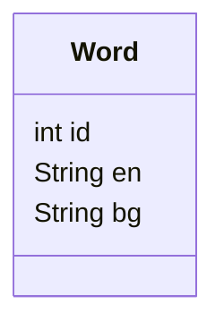

## Background

A couple of years ago, I read [Fluent in Three Months](https://www.amazon.ca/Fluent-Months-Anyone-Language-Anywhere/dp/0062282697/ref=sr_1_2?crid=3EIDH85VULGC&keywords=how+to+be+fluent+in&qid=1652553951&sprefix=how+to+be+fluent+in%2Caps%2C127&sr=8-2) and was inspired to tackle learning a new language.  **After studying and working with computer languages, I realized that learning new ones became easier and easier once I understood the underlying concepts**.  

Around the same time, I committed myself to **learning Bulgarian to a conversational level**.  The choice of language is primarily influenced by having direct access to multiple people that speak the language. I knew this would be critical for me to actually succeed in properly learning.

I needed somewhere to begin, but was disappointed to find that Duolingo doesn't support Bulgarian.  Thankfully, I stumbled on [bulgaro.io](https://www.bulgaro.io/).  This course is a fantastic and simple introduction to all of the key concepts in the Bulgarian language.  I was happy to pay the small subscription fee, knowing that it would motivate me to actually complete the course.  I **set up a routine** of a couple lessons every day and before long I **made it all the way through the course**.

I learned a lot in this time, particularly around the rules and conventions of the language.  But I was still completely incapable of stringing together full sentences. **Once I lost the structure of the course, I struggled to know where to invest my learning time into**.  Slowly I spent less and less time on it and the knowledge I had gained started to fade.

In two weeks, I travel to Bulgaria. I have picked things back up and am doing my best to get to a level where I can at least participate in some small way while there.  **I've started to craft my own structure for learning and as usual it has led me to build a small app to help consolidate knowledge**.

## Language Learning Strategies

### Listening to Songs

Listening to Bulgarian songs has been one of my favorite ways to learn new words and practice Bulgarian.  Ледено момиче by D2 is the first song I have poured effort into learning:

<iframe width="560" height="315" src="https://www.youtube.com/embed/ex3Jjs4wF9E" title="YouTube video player" frameborder="0" allow="accelerometer; autoplay; clipboard-write; encrypted-media; gyroscope; picture-in-picture" allowfullscreen></iframe>

I pull the lyrics to a song and then run them through Google Translate to get a fairly accurate translations (I usually fact check anything that sounds weird).  Thankfully, song lyrics are usually quite simple.  As an added bonus, **it is enjoyable to listen to the same song over and over again which helps reinforce the words**.

### Reading the News


<figcaption>24часа homepage (bg)</figcaption>

One other strategy I have picked up is to read Bulgarian news.  This is often a mentally taxing and stressful activity as **I get overwhelmed by the amount of words I don't know**.  My mind wants to shut down and **seek comfort of reading English again**. 

I use the built-in Translate this page tool in Google Chrome to cycle back and forth as I attempt to understand what articles are about.


<figcaption>24часа homepage (en)</figcaption>

## The `vocab` App

### Repository

The code for the web app described below can be found on [Github](https://github.com/adamjberg/engram/tree/main/vocab).

### What Should it Do?

I acquired basic vocabulary from my initial course and other learnings, but I have found it **difficult to decide what vocabulary to focus on**.  There is surely **some limit to the number of words I can properly encode in a given day**. 

**How do I identify what words I should be learning?**

**How can I make this learning more fun?**

Instead of picking random word lists, I instead want to intentionally seek out words to things that are relevant to the current day. That way I can have more associations to the word I just learned.  This has led me to a simple vocabulary app that allows me to quickly enter items as they comes up in my day to day.

I also want it to enhance my experience with my song learning and news reading. In order to do so, I want to be able to **paste a selection of Bulgarian text and have it highlight words in it that I already have saved**.  This does two things for me:

1. It shows me what words in a sentence I should already know
2. It shows me what words I don't know and should be translating and adding to my system

## Minimum Viable Product

### User Stories

- As a user, I can enter a Bulgarian word and provide the English translation
- As a user, I can highlight known Bulgarian words in given piece of text

### Entity Relationship Diagram



There are so many more things than this that I want this to do, but **capping it off here ensures that I will actually be able to complete this in a single programming session** and start using it the same day.

## Development

### Data Persistence

I wanted to keep data storage dead simple, so decided to just store the words in a csv file.  

```js
const words = [];
const csvFilename = "data/words.csv";

const wordsCsvContents = String(fs.readFileSync(csvFilename));
const rows = wordsCsvContents.split("\n");
for (const row of rows) {
  const cols = row.split(",");
  words.push({
    id: Number(cols[0]),
    en: cols[1],
    bg: cols[2],
  });
}
```

### Saving a New Word

#### UI


#### API

```js
app.post("/api/vocab", (req, res) => {
  // Typically your database gives you auto incrementing ids
  // This is a horrendously ugly way of getting a basic version
  let nextId = 1;
  if (words.length) {
    nextId = words[words.length - 1].id + 1;
  }

  const newWord = {
    ...req.body,
    id: nextId,
  };

  // I often think of adding the same word, this check ensures that a word paid can only be added once
  const existingWordIndex = words.findIndex((word) => {
    return word.en === newWord.en && word.bg === newWord.bg;
  });
  if (existingWordIndex >= 0) {
    return res.sendStatus(400);
  }

  // Need to add new word to csv file so on reload data persists
  fs.appendFileSync(
    csvFilename,
    `${newWord.id},${newWord.en},${newWord.bg}\n`
  );

  // Update cached array of words
  words.push(newWord);

  res.sendStatus(200);
});
```

### Highlighting a Word

#### UI


It's nothing fancy, but it gets the job done. 

#### API

```js
// Checks to see if Bulgarian word exists in current dataset
function findWordByBg(bg) {
  return words.find((word) => {
    return word.bg === bg;
  });
}

app.post("/api/highlight", async (req, res) => {
  const { body } = req.body;

  // Double spaces and new lines caused some grief, this was a simple hack to get words individually
  const wordsToCheck = body.replace(/[\s]/gi, " ").split(" ");

  let html = "<p>";
  for (const word of wordsToCheck) {
    // The split method still includes any punctuation next to a word
    // As I run in to instances where it is a problem, I add the character to replace below
    const foundWord = findWordByBg(word.replace(/[,\.-:]/gi, "").toLowerCase());
    if (foundWord) {
      html += `<mark>${word}</mark>`;
    } else {
      html += word;
    }
    html += "&nbsp;";
  }
  html += "</p>";
  res.json({
    html,
  });
});
```

## What Did I Learn?

> The purpose of a Minimum Viable Product is to gain a better understanding of what you should actually be building and how it should work.

### Grammar, Conjugations, and other Rules

Most langauges have some concept of applying minor changes to some root word. For nouns, you can have "apple" or "apples" ("ябълка" или "ябълки").  In English, usually this is just a "-s" or maybe "-es", but there's also **fun exceptions like "octopi"**. Bulgarian is no different and has more variety in how to pluralize a noun. Verbs have a similar issue with conjugations and tenses.

In using my highlighter for the first time, **I was faced with questions about how I'd like to handle storing this information**.  For now, I have resorted to adding every unique version of a word as it comes up in my learning.  But, I suspect there is some way to encode the rules of the language to have it automatically recognize variants of words.  

The neatest part of this challenge, is that this is the same problem I am currently struggling with.  I don't have the basic rules and conventions embedded in my brain yet. **My hope is that by forcing myself to write it out for a computer, the knowledge will be reinforced for myself.**

## What's Next?

Eventually I hope to be able to use this data to develop a fairly basic translation engine. Teaching is one of the most effective ways to learn something, and teaching a computer requires teaching it exactly what it needs to know.

I make several small apps like the above as part of my open source project [engram](https://github.com/adamjberg/engram).  If you have any thoughts or suggestions, feel free to head to the [Discussions board](https://github.com/adamjberg/engram/discussions) there.