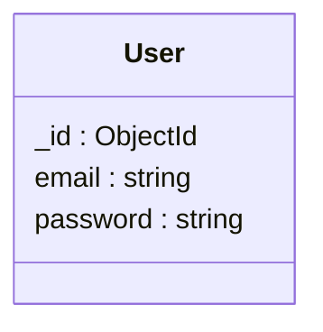

# Replacing Auth0 With Custom Authentication Solution

## How Did We Get Here?

When I first started building [Kaizen](https://kaizen.place), I decided to try out Auth0.  I have built user authentication before, but I really didn’t want to start there, I simply wanted to build an application.  From the variety of articles I read in the realm of user authentication, most tended to suggest just using some pre-built solution to avoid the hassle. I also wanted the ability to Sign in with Google, and this appeared to mostly come for free with the Auth0 integration.

### Confusing Setup

The initial implementation wasn’t without its hurdles.  While Auth0 documentation was reasonably extensive, it was debatably too much leading to more confusion than anything at times.  Knowing where to navigate to and which settings to turn on was a hassle.  

I struggle to even know how to describe what I eventually managed to cobble together. I eventually landed on some magic that looks like:

```jsx
import jwt from 'express-jwt';
import jwks from 'jwks-rsa';

export const jwtCheck = jwt({
  secret: jwks.expressJwtSecret({
    cache: true,
    rateLimit: true,
    jwksRequestsPerMinute: 5,
    jwksUri: 'https://kaizen-music.us.auth0.com/.well-known/jwks.json',
  }),
  audience: 'https://kaizen.place',
  issuer: 'https://kaizen-music.us.auth0.com/',
  algorithms: ['RS256'],
});
```

I don’t really have much of a clue what this is doing and I’m pretty sure I spent several hours searching for the information I needed to figure out how to even implement this.

### Tokens Everywhere

Auth0 provides a handy `@auth0/auth0-react` npm package for some helper hooks for your React application.  Before any request is made the access token needs to be fetched from Auth0:

```jsx
const { getAccessTokenSilently } = useAuth0();
```

At first I started tossing these before each API call, but eventually this left things quite cluttered.  I’m sure there could have been a way to abstract this away, but Cookie based sessions started looking mighty attractive.

## Why Bother?

At the end of the day, the current Auth0 implementation works as it needs to, so why bother redoing all of this?

### Cost

Like most PaaS solutions, the goal is to reel you in for the free plan to eventually price gouge you once you have enough users to start making money.  At 1000 users Auth0 starts charging $23 / mo and at 10,000 this climbs to $228 / mo.  Before long, we could easily be paying 1000s of dollars for something that really doesn’t seem that difficult.

### Lack of Control

There were some settings that allowed controlling session lengths, but these were limited to Auth0’s constraints.  We also saw all kinds of issues where peoples sessions would expire randomly, leading to failed requests and broken UI.

On top of this, the login/signup flows were mostly out of our control and emails from the service came through an auth0 email by default.  We wanted everything to be branded altogether, and while this technically was probably possible with Auth0, it was going to be more difficult to figure out how to do there, then to just properly implement in the first place.

## How to Replace Auth0?

As the issues persisted and my frustration with their monstrous dashboard grew, I took a step back and thought about the few things we were tangibly using Auth0 for:

1. Sign up
2. Login
3. Password Reset
4. Log in with google

And that’s it.  I have since implmented the bulk of these and have probably spent less time than I’ve spent learning and struggling with Auth0.  As an additional benefit, I can carry all of this knowledge over to any other project I work with.

### Sign Up Page


The sign up page includes just an email and a password, and a link to the log in page.

### Log In Page


The log in page is identical to the sign up page with an additional link to the Forgot password page

### Password Forget Flow


The password forget flow gets a little more complicated in terms of invalidating sessions.  At the moment I haven’t implemented this, but once I do I will add details here on how to accomplish

## Database Design



This is all we need in order to support signing up and logging in users.

## Creating a Temporary Bridge

With migrations like these, it’s often useful to allow both mechanisms to continue working.  I wasn’t sure how possible this was going to be, or whether it would be worth the effort, but in the end doing so significantly reduced the amount of code that needed the change.

### Updating Backend Middleware

Auth0 was setting the `req.user` property and we were primarily only using the `req.user.sub` property to identify which Artist a user has edit permissions on.

After wiring up the new login session code, it was now being stored on `req.session.user`.  I pondered replacing instances of `req.user.sub`, but instead landed on putting a session check in front of the Auth0 middleware.  With this I was able to overried `req.user.sub` to be set to `req.session.user` if a session was available.  This allowed me to avoid making any other changes across the backend, where I surely would have made some kind of mistake.

### Replacing useAuth0 React Hook

I faced a similar (and more widespread) issue on the front end.  The code was strewn with `useAuth0` hooks all over the place.  I ended up creating my own `useAuth` hook that I replaced all existing usages of `useAuth0` with across the app.  From here I could then return either the usual Auth0 function/variables or if I detected the user was logged in via our database, I could instead hijack those functions and return the correct information.

With this layer of abstraction I was able to make essentially 0 changes to the rest of my React code.  This new hook worked if the user logged in using auth0 and continued to work if they logged in using our new custom authentication.

See below for a rough outline of what the `useAuth` hook looks like:

```tsx
import { useAuth0 } from '@auth0/auth0-react';
import { useCallback, useEffect, useState } from 'react';
import { useDispatch, useSelector } from 'react-redux';
import { useHistory } from 'react-router';
import { userApi } from '../apis/UserApi';
import { isAuthEnabled } from '../config';
import { setUser } from '../redux/actions/UserActions';
import { StateType } from '../redux/reducers';
import { ROUTES } from '../utils/routes';

export function useAuth() {
  const dispatch = useDispatch();
  const { user: kaizenUser } = useSelector((state: StateType) => {
    return {
      user: state.user,
    };
  });
  const history = useHistory();
  const { user, getAccessTokenSilently, isAuthenticated, isLoading, loginWithRedirect, logout } =
    useAuth0();

  useEffect(() => {
    async function getMe() {
      try {
        const { data } = await userApi.me();
        if (data) {
          setUser(dispatch, data);
        }
      } catch (err) {}
    }
    getMe();
  }, []);

  const loginWithRedirectCallback = useCallback((options) => {
    if (isAuthEnabled) {
      history.push(ROUTES.User.login);
    } else {
      loginWithRedirect(options);
    }
  }, []);

  const getAccessTokenSilentlyCallback = useCallback(async () => {
    if (kaizenUser) {
      return '';
    } else {
      return getAccessTokenSilently();
    }
  }, [kaizenUser]);

  const logoutCallback = useCallback(
    (options: any) => {
      if (kaizenUser) {
        userApi.logout().then(() => {
          setUser(dispatch, null);
        });
      } else {
        logout();
      }
    },
    [kaizenUser],
  );

  return {
    user: kaizenUser ? kaizenUser : user,
    isLoading: kaizenUser ? false : isLoading,
    loginWithRedirect: loginWithRedirectCallback,
    logout: logoutCallback,
    getAccessTokenSilently: getAccessTokenSilentlyCallback,
    isAuthenticated: kaizenUser ? true : isAuthenticated,
  };
}
```

### Migrating Existing Auth0 Users to Our Database

Now that we are able to login via Auth0 and with the new custom method, we disabled the ability to sign up using Auth0.  This ensures that no new users will create Auth0 accounts.

The existing users in Auth0 need to be migrated into our new database collection. There are about 100 users that have signed in via Auth0.  Roughly half have signed up with Google and the other half used an email / password combination.

### Exporting Users

As per [Auth0 docs](https://auth0.com/docs/manage-users/user-migration/user-import-export-extension) I had to install an extension to be able to export the users.  Something that reasonably seems like it should just exist within the main dashboard.  After a few seconds I successfully had myself a csv of our 90 users.


### Google Users

Migrating the Google users is simple.  We can create a User in our database for each Auth0 user assigning the email they used to sign up to the `email` property of our User model.  When they go to login with Google using our new log in page, it can confirm the account they logged in with matches the email we have in our database.

### Email / Password

The users that signed up with a password are a bit more difficult to deal with.  The export does not give access to their password (it would be alarming if it did…).  Instead we will need some mechanism to have the user create a new password for the user stored in our database.

A password reset flow successfully handles this.  This means that we can notify existing users to simply reset their password in order to start using Kaizen again.

## Conclusion

Based on my experience with Auth0, I would strongly caution against the use of a service like this.  This post was mostly about how to migrate off of Auth0 when you already have a set of users on Auth0, but in a future post I will more specifically dive into how to build the key pieces of an authentication system using Node.js.
