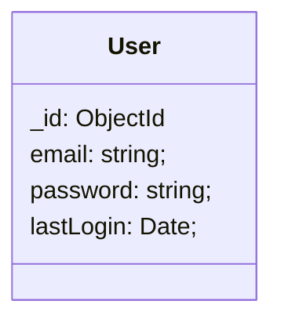
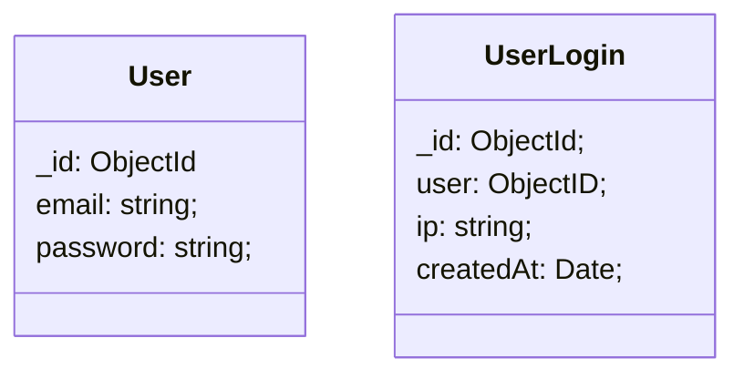

**---- Work In Progress ----**

Database migrations seem to be an under taught concept in the realm of full-stack web development.  I have run several in the last several years and here is a breakdown of what I wish someone had told me at the start.

## My First Migration

My first experience with migrations came from Django.  I was building a registration website for the Student Leadership Conference at UBC.  A friend recruited me to the efforts under the impression that I "know how to code".  Unfortunately for them (and me), by this point most of my knowledge revolved around low level C and hardware.  Web development was completely new to me. I had a full engineering course load and a job as a residence advisor and against my better judgement agreed to commit to this Registration Coordinator position.

I inherited a Django/Python project that had been built for the previous year's conference.  I managed to get 30 minutes of time to talk to the person that built it and that was about it.  I don't remember if they said to not ask them any further questions than that, but I got the impression that I wasn't going to be getting help from this person in the future.

This wasn't my first experience with Django.  At a previous co-op position, the company I worked for used Django to build the website that surrounded the Flash game that I helped develop.  However, my role there was almost exclusively working on the game itself in ActionScript 3.  I technically was running Django, but only really knew the magical command to start things up.  I ended up getting quite invested into ActionScript 3 and never got the chance to dive too deeply into the Django / web development side of things.

Now that I'm faced with an overwhelming Django project I've inherited I decide the Django tutorial is the best place to start.  This is still hands-down one of the best tutorials I have ever run through.  So much so, that I often recommend it to JavaScript developers to expand their horizons and learn some of the fundamentals.

By the second page of the tutorial, you are introduced to the `makemigrations` and `migrate` commands.  In the countless "Full Stack JavaScript" tutorials I have done or skimmed, I can't remember a single one that mentions migrations.  There's an overabundance of people uselessly arguing over front end frameworks, but a substantial lack of information rooted in primitive concepts.

Django autogenerates code for migrations and provides reasonable defaults for how to actually run these migrations.  In the shift to NoSQL, it seems we lost this emphasis on how to write solid migrations.  You might even be thinking: "why would you need migrations for a schemaless database?"

## Breaking Down A Migration

Just like code needs to be refactored, so too does data.  Some times this is to help clean up the structure of your documents, but often it is in order to support some new requirement that has been added.

Let's take a hypothetical example of an app that originally stored the last time a user logged in under the `lastLogin` property.  Some new security requirements emerge that require you to log the IP address of every log in attempt.  We could simply add an ever growing array property on the User document, but this pollutes the collection with data it shouldn't really be concerned with and, if you're using MongoDB, you have the eventual concern of reaching the document size limit as arrays cannot be infinite.

### Starting Schema

When planning out a migration I like to list out the involved suspects.  mermaidjs has won my heart as it allows me to do this in text without having to open another program.  This makes it easy to write, while also visually helping communicate where things are at.

### Identifying End Schema

It may sound obvious that this is the next step, but I think people often start writing the migration before they've even fully decided on what the end goal is.  If you cannot succinctly describe what the new schema will be, **do not** start writing the schema.  This example is fairly simple, but more complicated ones might involve the moving around of multiple properties and you want to make sure you have all of them straight.

### How to Handle "Moved" Properties

In our new schema, `lastLogin` is completely removed from the User document.  This is because we can determine the last login by querying the new UserLogin collection: e.g. `UserLogin.find({ user })` 

Side Note: after writing the previous paragraph I realized I was missing the `user` property on the UserLogin document and had to add to the end schema above.  This illustrates how easy it is to make such a simple mistake that could be catastrophic if it slips through.  Adding some ceremony and write ups to migrations encourages talking yourself and others through the migration to confirm you have a solid understanding of how the new data will be used.

Now that we have our final schema, we can start writing our migration, right?  No!  There is an above 50% chance you still don't have the schema right.  More importantly, before this new schema becomes useful, we need to have new code that handles the new UserLogin collection.

### Update Code to Start Writing New Objects With New Schema

In order to create a seamless migration experience, we need to start creating UserLogin documents before we've actually run the migration.

This might feel counter-intuitive at first, but doing so ensures that after the migration is done there will no longer be any documents left in the shape of the old schema.  If this part came second, we would need to re-run the migration to cover any additional documents that were created between the time the migration was run and the code was updated to use the new schema.

In our example, this means starting to create `UserLogin` documents for every user login. No code will exist yet to actually access them, but that will come in the next step.  I like to keep these steps separate conceptually, but I would highly recommend they get deployed together.  This helps avoid the real possibility that you've maybe missed a field or requirement.

### Write Code to Start Reading New Objects

Before we go even a step further, you have some concept of feature flags...right?  If you don't, stop reading this right now and implement feature flags in your application.

The feature flag is important here because it allows you to test out your new schema in production before you have run the final migration.  

In our example, imagine we have a new page for the user to list out all the logins on their account.  This page replaces or enhances an existing one that simply displays the last login date.  If we deploy this new page without a feature flag, the user would lose access to whatever their current `lastLogin` value is.  This is arguably not that important, but in another situation it is possible that this temporary loss of information is unacceptable. (TODO: use better example to demonstrate this)

### Test Behind Feature Flag in Production

Now that you've deployed the previous two steps, you should be writing UserLogin documents for every log in.  You are able to turn on the Feature Flag for your own account and confirm that the new login log page is correctly fetching these new documents and all the information you dreamed up is there.

Very often, you will realize at this step, that there is some other piece of information you want.  Catching this at this point saves you from starting this migration process all over again, which can save tons of time (and frustration).

Imagine your team now decides that they want to include the user agent as well in order to help the user identify which device the log in corresponds to.  You can simply move back to the previous step and update the code to start writing that property on the UserLogin document in addition to the others.

### Write the Migration

By this point, you should be very familiar with the models and schema changes involved.  You've been querying your new collection and have full confidence that the schema you've landed on is correct.

### Migrations Should Go Up and Down

I have learned this lesson the hard way a few times.  When writing a migration, it should be possible to "undo" the migration by running what is commonly referred to as a "down" migration.

In development, this is useful to test and build confidence in the migration script.  You can run it many times up, then down, and up again.  I have found this helpful when attempting to deal with large scale migrations.  For these, I generally write the simplest version of the migration possible.  This is often a simple for loop over an entire collection.  

This works perfectly fine for my local database where there are only a few entries, but on a collection with a million entries, very quickly we land in the several hours territory.  Once I have the core migration solid, I move on to optimizing and parallelizing migrating up and down to make sure I haven't introduced some new issue with these new complexities.

### Run the Migration

Now that you've done your testing against a local database it's time for the finale.  Before running the migration on a production dataset, I like to run through a checklist of a few things.  I ask myself what is the worst thing that could happen if something goes wrong.  

This is a reminder that errors should be expected on pretty much every single operation.  Did I assume that a property always exists, but in reality there are some production documents where that isn't true?  What happens if the network craps out in the middle of this migration?  Will my data be left in some half way state?  How long should this migration take?

Once everything checks out on the checklist, we are ready for liftoff.  A database should be treated like a space shuttle launch.  That sounds a bit dramatic, but the cleanup of a botched migration can easily spill into thousands of lost dollars and and hours piecing things back together.  

What's the worst that could happen you might think?  Back in the early MongoDB days the update command allowed you to simply pass an object.  In our example maybe we did a `User.updateOne({ _id }, { lastLogin: null })` to clear out the lastLogin property.  You choose not to follow the advice in this article and end up running a migration with this in production only to find that the `updateOne` command overwrote the entire User object with `{ lastLogin: null }`.  Every single user is now unable to login to your application.  Hopefully you have database backups (if you don't stop reading and enable backups) as this is now the only way to retrieve the information you just accidentally deleted.  Depending on the rest of your application this error might end up causing additional data consistency issues as background processes continue using this new botched documents and this simple mistake is now polluting documents in other collections.  You now need to write a migration to fix the botched migration and this one is a lot harder to write.  I have had to clean up at least one migration that followed a pattern like this, and let me tell you it was not an enjoyable experience.

### Test Migration Behind Feature Flag

One last check to make sure the old data was correctly transferred to the new schema.

### Enable Feature Flag For Everyone

Once confident that everything worked as intended and is looking correct the flag can be enabled for everyone using the application.  You might still roll this out slowly to watch for any unforseen consequences in other user accounts.

### Remove Feature Flag

It's easy to want to just move on at this point.  It's been a long journey up until this point and you've just sweat bullets running a migration on the production database.  Do yourself a favor and once it's clear there are no issues with this migration or the new UI, rip out the feature flag so it doesn't continue living in your codebase forever.  If you don't do it now, I can almost guarantee you will never do it!